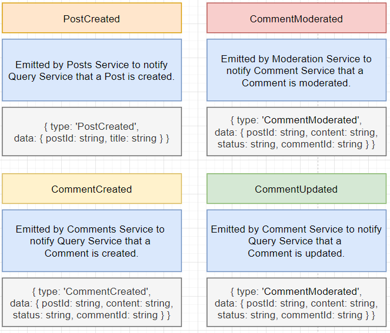
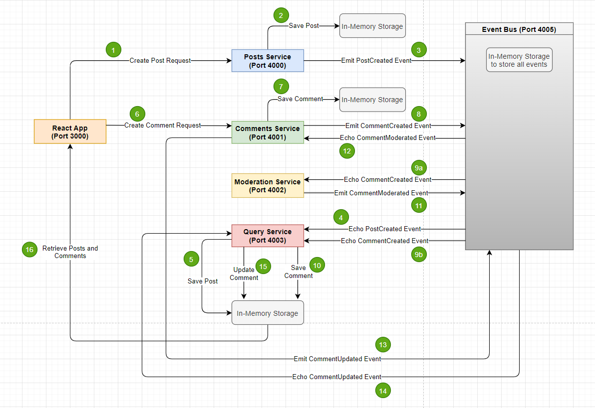
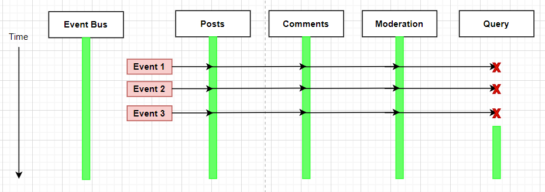
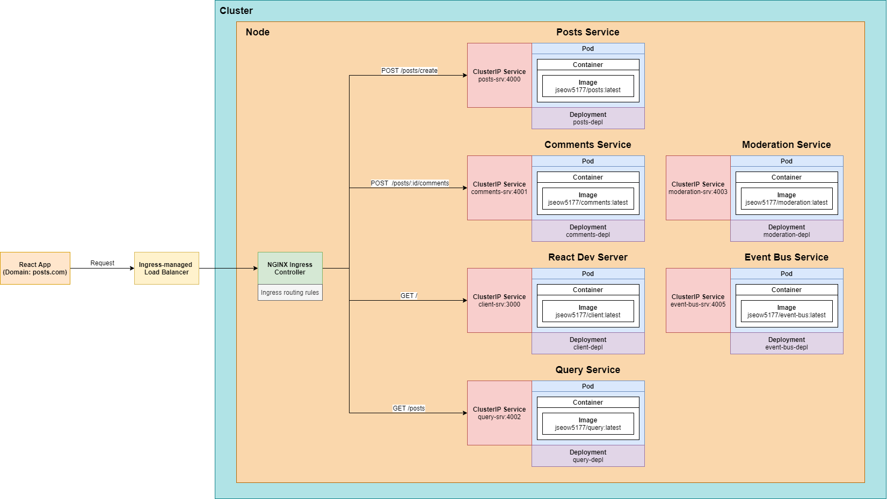

# A Mini Microservices Application

This is a minimalistic React, Node and Express application that demonstrates the basic concepts of event-based microservices.

## Content
1. [Monolithic Server vs Microservices](#monolithic-server-vs-microservices)

2. [Why Microservices?](#why-microservices-?)

3. [Benefits of Database Per Service](#benefits-of-database-per-service)

4. [Data Management in Microservices](#data-management-in-microservices)

5. [App Overview](#app-overview)

6. [Events](#events)

7. [APIs](#apis)

8. [Event Flow](#event-flow)

9. [Basic Design Challenges and Solutions](#basic-design-challenges-and-solutions)

10. [Implementation with Docker and Kubernetes](#implementation-with-docker-and-kubernetes)

## Monolithic Server vs Microservices

A monolith contains routes, middlewares, business logic and database access to implement **all features** of an application.

On the other hand, a single microservice contains routes, middlewares, business logic and database access to implement **one feature** of an application.

## Why Microservices?
1. Increased resilience.
    - With microservices, the entire application is decentralized and decoupled into services that act as separate entities.
    - Failure of one service has minimal impact on other services.
2. Improved scalability.
    - Since each service is a separate component, you can easily scale up a single service without having to scale the entire application.
    - This saves costs and simplify scalability requirements.

## Benefits of Database-Per-Service

In microservices design, each service gets its own database (if it needs one) and services will never reach into another service's database.

1. We want each service to run independently of other services.
    - If a centralised database is used, all services will fail if the database fails to work correctly.
    - At the same time, scaling the database will be a challenge as different services might have different requirements.
2. Some services might function more efficiently with different types of DBs (SQL vs No-SQL).

## Data Management in Microservices

There are different communication strategies between services in a microservice architecture. They can be distinguished into **sync** and **async** communications.

### Sync Communication

In Sync Communication, services communicate with each other using **direct requests**.

#### Pros
1. Conceptually easy to understand.
2. As observed in Service D above, it doesn't need a database!
#### Cons
1. Introduces a dependency between services.
2. If any inter-service request fails, the overall request fails.
3. The entire request is only as fast as the slowest request.
4. Can easily introduce nested requests.

### Async Communication with Events
All services will communicate through an event bus by emitting and receiving events.

For example, for Service D to function, it will need user information from Service A. First, it emits an event to the event bus requesting for user information. The event can have a type and a payload.

The event bus will know how to route and handle events accordingly. In this case, the event bus will pass the event of type UserQuery to Service A.

Once Service A processes the event, it will emit a new event with the data requested by Service D to the event bus. The event bus then routes the new event back to Service D.

This process repeats for the rest of the information Service D requires from other services.

#### Pros
1. Same as Sync communication.
#### Cons
1. Same as Sync communication.

### Another variant of event-based communication
What if we give Service D a database where it stores only the information it requires?

However, how do we create such a database? Consider the following,

1. Whenever there is a request for product creation, Service B processes the request and saves the product into its own database.
2. At the same time, Service B emits a ProductCreation event to the event bus. The event contains only the information required by Service D.
3. The event bus routes the event to Service D, which then Service D saves the information into its own database,
4. Now, whenever Service D requires product information, it doesn't need to make direct or event-based requests to Service B anymore. It can just extract the required information from its own database.

#### Pros
1. Service D has zero dependencies on other services.
2. Service D will be extremely fast.
#### Cons
1. Data duplication. Extra DB and extra storage required.
2. Much more complicated to understand and maintain.

## App Overview
In this mini microservices app, we will create 5 main functionalities:
1. Create a Post
2. List all Posts
3. Create a Comment
4. List all Comments
5. Moderate Comments

A Post can have zero or many Comments.

### App Design

1. We have a React frontend that allows user to add / retrieve posts and comments. 
2. All Services are simple Express applications.
3. Posts Service handles Posts creation.
4. Comments Service handles Comments creation.
5. Moderation Service handles Comments moderation. It flags Comments with the restricted word "orange".
6. Query Service handles the retrieval of all posts along with their comments.
7. No databases will be used. All Posts and Comments will be stored in in-memory storages.
8. Event bus handles the event-based communication between services.
9. Event bus also stores past events that have occured.

### Event Bus Implementation
1. There are many well-establish implementations of event bus such as RabbitMQ, Kafka, NATS, etc.
2. In this simple application, it will just be an Express application that receives and publishes event.
3. This is by no means a production-ready event bus.

### Events

### APIs

#### Posts Service

#### Comments Service

#### Query Service

#### Moderation Service

#### Event Bus

### Event Flow

### Basic Design Challenges and Solutions
1. Network requests minimization
    - Without the Query Service, the frontend will have to retrieve all posts first via the Posts Service. Then, for each post, it will request for the comments from the Comments Service. 
    - This will greatly increase the number of network requests required, which can be inefficient.
    - The Query Service is created so that the React frontend can retrieve all posts along with their respective comments in one network request.
    - Moreover, if the Posts and Comments Service go down, users can still retrieve old posts and comments via the Query Service.
2. Event Sync - Dealing with Missing Events
    - If Query Service goes down, any events that arrive at it will be ignored entirely. When it goes back up again, it will have no memory of the events that it has missed.

    

    - This causes data inconsistencies among services. The Query Service might be missing some old posts and comments.
    - To tackle this issue, we will allocate some memory for the event bus to store past events that have occured. Whenever Query Service starts, it will call the event bus to retrieve the old events that have occured. This notifies the Query Service on everything that has happened (post creation, comment update, etc) while updating its posts and comments data as necessary.
3. CommentUpdated vs CommentModerated
    - Comment moderation is a business logic that belongs to the comments resource.
    - Business logic of a resource should be handled and contained within its service, which is the Comments Service.
    - The Query Service deals with only the presentation logic. It shouldn't be concerned with how and why a comment is updated. It should only be aware of **when** a comment is updated.
    - This is the purpose of the CommentUpdated event received by the Query Service. It doesn't tell how a comment should be updated. That is handled by the CommentModerated event received by the Moderation Service.

## Implementation with Docker and Kubernetes

To start the application, at the root directory, run `skaffold dev`.

### Basic Terminologies

1. Cluster: A set of Nodes that run containerized applications managed by Kubernetes.
2. Node: A worker machine as part of a cluster. In this application, there is only one node.
3. Ingress: An API object that manages external access to the services in a cluster.
    - Traffic routing is controlled by a set of rules defined in an Ingress resource.
    - An Ingress Controller is used to carry out the rules of the Ingress.
    - An Ingress Controller usually fulfills the Ingress with a load balancer.
4. Service: An abstract way to expose an application running on Pods as a network service. There are ClusterIP, NodePort and LoadBalancer service.
    - ClusterIP: Exposes a pod within the cluster. Used to handle communications between services.
    - NodePort: Exposes a pod to the outside of a cluster. Usually used to development purposes only.
    - LoadBalancer: Also exposes a pod to the outside of a cluster. Tells Kubernetes to reach out to its cloud provider and provision a load balancer.
5. Deployment: Creates and manages Pods. A Deployment always ensures that there are a certain number of Pods running, depending on what is specified in the configuration. 
6. Image: The receipe to run a container. It contains a snapshot of all the files, code and dependencies needed to start a container. When we run an Image, it will be allocated resources (memory, network, etc) which forms a container. 
7. Container: A package with the program to execute and all its dependencies, such as the code, runtime, system libraries, etc, all bound together in a box. It is an instance of an Image.
8. Pod: The smallest deployable unit in Kubernetes. It houses one or many containers with some specifications on how to run the containers,

### Application Architecture

1. There is only one Cluster with a Node in it. The Node has 6 different Pods, each with only one Container in it.
2. Each Container is built with a Docker Image of the service it represents. An Image has the name of `jseow5177/<service_name>`. For example, the Posts Service has an Image named `jseow5177/posts`.
3. Each Pod has a ClusterIP Service to manage communication between services in a Cluster. A ClusterIP Service has a name of `<service_name>_srv`. For example, the Posts Service has a ClusterIP Service named `posts_srv`.
4. Each Pod has a Deployment that creates and manages the Pod. A Deployment has a name of `<service_name>_depl`. For example, the Posts Service has a Deployment named `posts_depl`.
5. The Ingress controller used in this application is the **NGINX Ingress Controller**.
6. Skaffold is used for easy deployment and update of code in Pods.

### Basic Commands

`docker build -t <image_tag> <path_to_Dockerfile>`

Builds a Docker Image.

`docker run <image_tag>`

Spins up a Docker Container.

`kubectl apply -f <config_file>`

Runs a Kubernetes yaml config file. Used to create Kubernetes Objects such as Pods, Deployments and Services.

