# A Mini Microservices Application

This is a minimalistic React, Node and Express application that demonstrates the basic concepts of event-based microservices.

## Content

## Monolithic Server vs Microservices

A monolith contains routes, middlewares, business logic and database access to implement **all features** of an application.

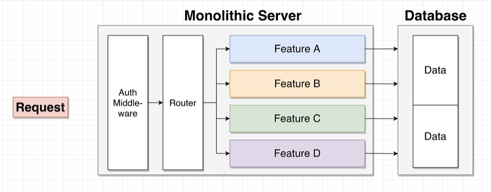

On the other hand, a single microservice contains routes, middlewares, business logic and database access to implement **one feature** of an application.

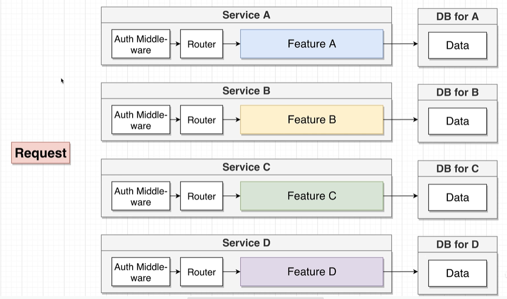

## Why Microservices?
1. Increased resilience.
    - With microservices, the entire application is decentralized and decoupled into services that act as separate entities.
    - Failure of one service has minimal impact on other services.
2. Improved scalability.
    - Since each service is a separate component, you can easily scale up a single service without having to scale the entire application.
    - This saves costs and simplify scalability requirements.

## Benefits of Database-Per-Service

In microservices design, each service gets its own database (if it needs one) and services will never reach into another service's database.

1. We want each service to run independently of other services.
    - If a centralised database is used, all services will fail if the database fails to work correctly.
    - At the same time, scaling the database will be a challenge as different services might have different requirements.
2. Some services might function more efficiently with different types of DBs (SQL vs No-SQL).

## Data Management in Microservices

There are different communication strategies between services in a microservice architecture. They can be distinguished into **sync** and **async** communications.

### Sync Communication

In Sync Communication, services communicate with each other using **direct requests**.

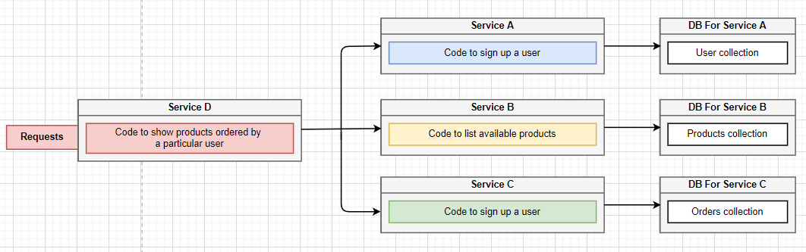
#### Pros
1. Conceptually easy to understand.
2. As observed in Service D above, it doesn't need a database!
#### Cons
1. Introduces a dependency between services.
2. If any inter-service request fails, the overall request fails.
3. The entire request is only as fast as the slowest request.
4. Can easily introduce nested requests.

### Async Communication with Events
All services will communicate through an event bus by emitting and receiving events.

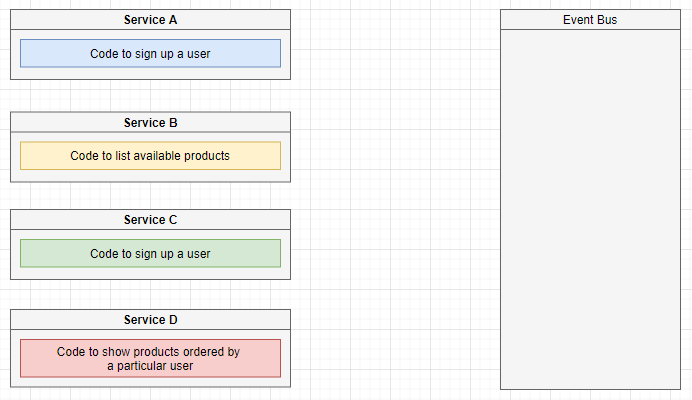

For example, for Service D to function, it will need user information from Service A. First, it emits an event to the event bus requesting for user information. The event can have a type and a payload.

The event bus will know how to route and handle events accordingly. In this case, the event bus will pass the event of type UserQuery to Service A.

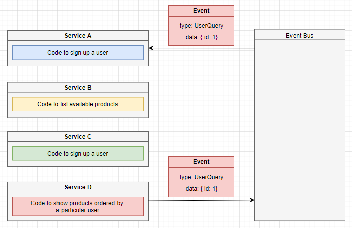

Once Service A processes the event, it will emit a new event with the data requested by Service D to the event bus. The event bus then routes the new event back to Service D.

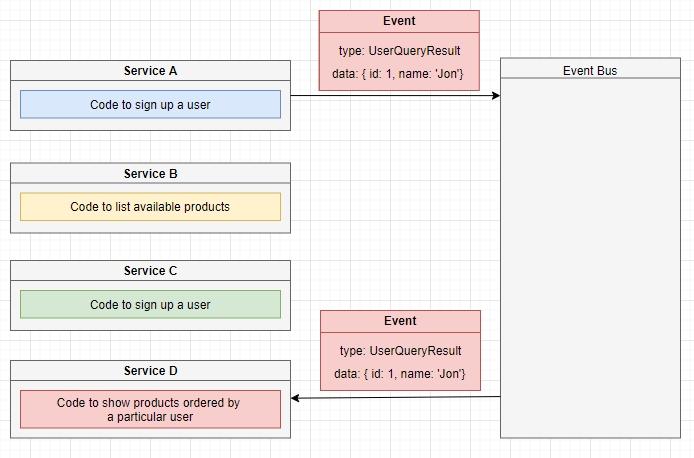

This process repeats for the rest of the information Service D requires from other services.

#### Pros
1. Same as Sync communication.
#### Cons
1. Same as Sync communication.

### Another variant of event-based communication
What if we give Service D a database where it stores only the information it requires?

However, how do we create such a database? Consider the following,

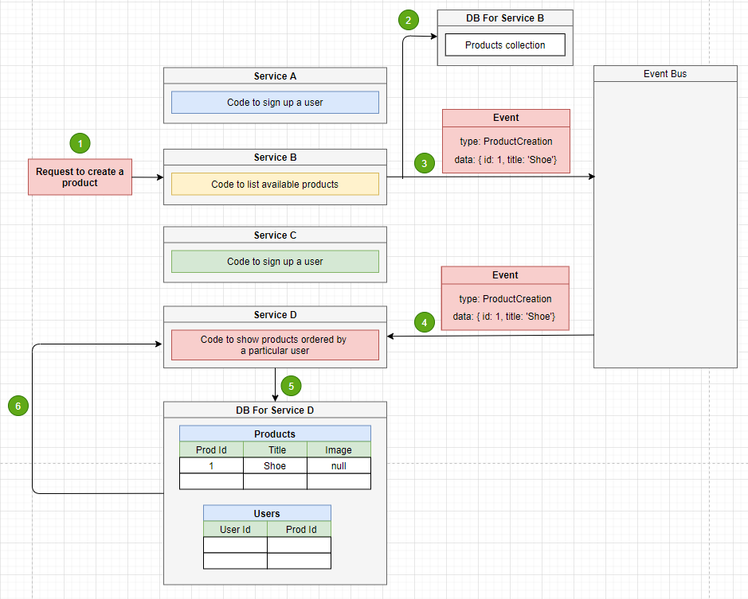

1. Whenever there is a request for product creation, Service B processes the request and saves the product into its own database.
2. At the same time, Service B emits a ProductCreation event to the event bus. The event contains only the information required by Service D.
3. The event bus routes the event to Service D, which then Service D saves the information into its own database,
4. Now, whenever Service D requires product information, it doesn't need to make direct or event-based requests to Service B anymore. It can just extract the required information from its own database.

#### Pros
1. Service D has zero dependencies on other services.
2. Service D will be extremely fast.
#### Cons
1. Data duplication. Extra DB and extra storage required.
2. Much more complicated to understand and maintain.

## App Overview
In this mini microservices app, we will create 5 main functionalities:
1. Create a Post
2. List all Posts
3. Create a Comment
4. List all Comments
5. Moderate Comments

A Post can have zero or many Comments.

### App Architecture

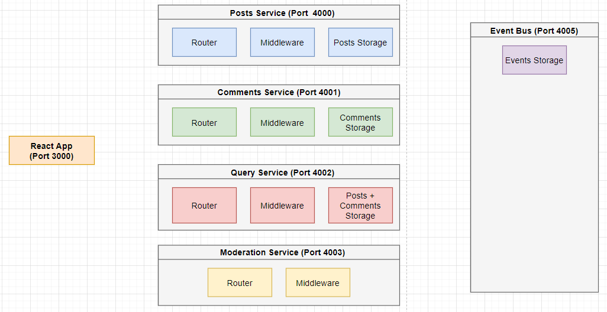

1. We have a React frontend that allows user to add / retrieve posts and comments. 
2. All Services are simple Express applications.
3. No databases will be used. All Posts and Comments will be stored in in-memory storages.
4. An event bus service will be used to regulate the flow of events among other services.
5. The event bus also stores past events that have occured.
6. The Query Service is used as a **network requests minimization strategy**.
    - Without Query Service, the React frontend will have to make separate network requests to the Posts and Comments Services to retrieve all Posts and Comments.
    - The Query Service will combine and store all the Posts and Comments appropriately in an efficient data structure. The React frontend can then retrieve all the data required by making one request to the Query Service.
7. The Moderation Service will be used to moderate the content of Comments and flag Comments with the restricted word "orange".

### Event Bus Implementation
1. There are many well-establish implementations of event bus such as RabbitMQ, Kafka, NATS, etc.
2. In this simple application, it will just be an Express application that receives and publishes event.
3. This is by no means a production-ready event bus.

### Events

### APIs

#### Posts Service

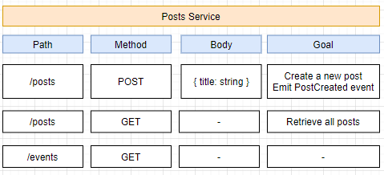

#### Comments Service

#### Query Service

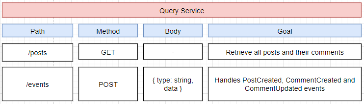

#### Moderation Service

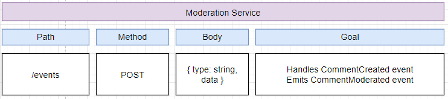

#### Event Bus

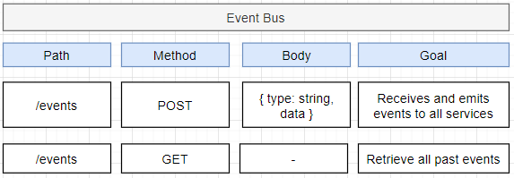

### Event flow